# 核心支付生命周期时序图 (Core Payment Lifecycle)

这份文档描述了 BonusPay 收银台的核心状态流转逻辑，用于指导测试用例编写。

> **图例说明:**
> - **Participants:**
>   - **User:** 最终用户
>   - **UI:** 收银台界面组件 (WalletGrid, ActionConsole 等)
>   - **Hook:** 核心状态机 (useCheckoutState)
>   - **Wagmi:** 钱包连接库与 Web3 钱包实例
>   - **Chain:** 区块链网络

```mermaid
sequenceDiagram
    autonumber
    participant User
    participant UI as Frontend UI
    participant Hook as useCheckoutState
    participant Wagmi as Wagmi SDK / Wallet
    participant Chain as Blockchain Network

    %% ============================================================
    %% 场景 1: 标准 Web3 钱包连接流程
    %% ============================================================
    Note over User, Chain: 场景 1: 标准 Web3 钱包连接 (Wallet Connection)

    User->>UI: 点击钱包图标 (例如 MetaMask)
    UI->>Hook: selectWallet('metamask')
    Hook-->>UI: 状态变更为 FOCUS -> DEBUG_INTERCEPT (Demo模式)
    
    Note right of UI: 开发模式下模拟路径选择
    User->>UI: 点击 "Simulate Success"
    UI->>Hook: selectPath('success')
    Hook-->>UI: 状态变更为 PROCESSING (呼吸动画)
    
    rect rgb(240, 248, 255)
        note right of Hook: 关键逻辑: "Double Reset" (先断后连)
        Hook->>Wagmi: disconnectAsync()
        Note right of Hook: 确保清除旧 session
        Hook->>Wagmi: connectAsync()
        activate Wagmi
        Wagmi-->>User: 唤起钱包插件/应用
        User->>Wagmi: 批准连接请求
        Wagmi-->>Hook: 连接成功 (isConnected = true)
        deactivate Wagmi
    end
    
    Hook->>Hook: useEffect 监听到连接状态
    Hook-->>UI: 状态变更为 CONNECTED_CHAIN_SELECT
    UI-->>User: 展示链选择界面 (ChainSelector)

    %% ============================================================
    %% 场景 2: 支付指令与签名
    %% ============================================================
    Note over User, Chain: 场景 2: 支付执行 (Payment Execution)

    User->>UI: 选择支付网络 (例如 Ethereum)
    UI->>Hook: selectChain('1')
    Hook-->>UI: 状态变更为 CONFIRMATION_PHASE
    UI-->>User: 展示确认订单页 (ActionConsole)

    User->>UI: 点击 "Submit Order"
    activate UI
    UI->>Wagmi: sendTransactionAsync()
    Wagmi-->>User: 钱包弹出签名/交易请求

    alt 用户确认签名 (Happy Path)
        User->>Wagmi: 确认/签名
        Wagmi->>Chain: 广播交易
        Wagmi-->>UI: 返回 TxHash
        UI->>Hook: submitOrder()
        Hook-->>UI: 状态变更为 PROCESSING
        Note right of Hook: 模拟上链等待 (1s)
        Hook-->>UI: 状态变更为 SUCCESS
        UI-->>User: 展示支付成功页 (PaymentSuccess)
    else 用户拒绝/失败 (Exception)
        User->>Wagmi: 拒绝操作
        Wagmi-->>UI: 抛出 UserRejected 错误
        UI-->>User: 停留在确认页 / 提示错误
    end
    deactivate UI

    %% ============================================================
    %% 场景 3: 异常处理与降级
    %% ============================================================
    Note over User, Chain: 场景 3: 连接失败自动降级 (Fallback Flow)

    User->>UI: 选择钱包
    UI->>Hook: selectPath('fail') (模拟失败)
    Hook->>Wagmi: connectAsync()
    Wagmi-->>Hook: 抛出 Connection Error (Timeout/410)
    Hook-->>UI: 状态变更为 FALLBACK
    UI-->>User: 展示错误提示 + "Try Address Transfer" 选项

    %% ============================================================
    %% 场景 4: 手动转账 (Address Transfer)
    %% ============================================================
    Note over User, Chain: 场景 4: 手动地址转账 (Address Transfer)

    User->>UI: 点击 "Address Transfer" 或从降级页进入
    UI->>Hook: selectWallet('transfer')
    Hook-->>UI: 状态变更为 TRANSFER_FLOW
    UI-->>User: 展示 AddressTransferPanel

    User->>UI: 选择网络 (例如 BSC)
    User->>UI: 点击 "Generate Address"
    UI-->>User: 展示充值地址 + QR Code

    Note over User, UI: 用户在外部钱包完成转账

    %% ============================================================
    %% 场景 4.1: 少付 (Partial Payment)
    %% ============================================================
    rect rgb(255, 250, 240)
        Note right of User: 分支 A: 少付场景 (Partial Payment)
        User->>UI: 点击 "Check Payment Result" (搜索图标)
        UI->>Chain: 查询链上交易记录
        Chain-->>UI: 返回交易: 15.00 USDT (少于 20.00)
        UI->>UI: 更新状态为 PARTIAL_PAID
        UI-->>User: 显示支付进度卡片
        Note over UI: 已付: 15.00 USDT<br/>待付: 5.00 USDT
        
        User->>UI: 再次转账剩余金额
        User->>UI: 再次点击 "Check Payment Result"
        UI->>Chain: 查询链上交易记录
        Chain-->>UI: 返回新交易: +5.00 USDT
        UI->>UI: 累计金额 = 20.00, 状态变更为 SUCCESS
        UI->>Hook: setTransferSuccess(true)
        UI-->>User: 展示支付成功页 (PaymentSuccess)
    end

    %% ============================================================
    %% 场景 4.2: 多付 (Overpayment)
    %% ============================================================
    rect rgb(240, 255, 240)
        Note right of User: 分支 B: 多付场景 (Overpayment)
        User->>UI: 点击 "Check Payment Result"
        UI->>Chain: 查询链上交易记录
        Chain-->>UI: 返回交易: 25.00 USDT (多于 20.00)
        UI->>UI: 更新状态为 OVER_PAID
        UI-->>User: 展示支付成功页 + 多付提示
        Note over UI: 实付: 25.00 USDT<br/>订单金额: 20.00 USDT<br/>多付: 5.00 USDT (将退回)
    end

    %% ============================================================
    %% 场景 4.3: 正常支付 (Exact Payment)
    %% ============================================================
    rect rgb(240, 248, 255)
        Note right of User: 分支 C: 精确支付 (Exact Payment)
        User->>UI: 点击 "Check Payment Result"
        UI->>Chain: 查询链上交易记录
        Chain-->>UI: 返回交易: 20.00 USDT (精确匹配)
        UI->>UI: 更新状态为 SUCCESS
        UI->>Hook: setTransferSuccess(true)
        UI-->>User: 展示支付成功页 (PaymentSuccess)
    end
```

## 测试用例建议

基于以上时序图，QA 团队应重点覆盖以下测试场景：

### 1. Web3 连接测试
- ✅ 正常连接流程 (MetaMask/OKX/Binance)
- ✅ 用户拒绝连接
- ✅ 网络超时/连接失败
- ✅ 重复连接 (Double Reset 验证)

### 2. 支付执行测试
- ✅ 正常签名并广播
- ✅ 用户拒绝签名
- ✅ Gas 不足
- ✅ 网络拥堵导致超时

### 3. 手动转账测试
- ✅ **少付场景:** 分多次转账直至满足订单金额
- ✅ **多付场景:** 单次转账超过订单金额
- ✅ **精确支付:** 单次转账恰好等于订单金额
- ✅ 地址复制功能
- ✅ QR Code 生成与扫描

### 4. 异常降级测试
- ✅ 连接失败自动跳转至 Fallback 页面
- ✅ Fallback 页面的 "Try Address Transfer" 功能
