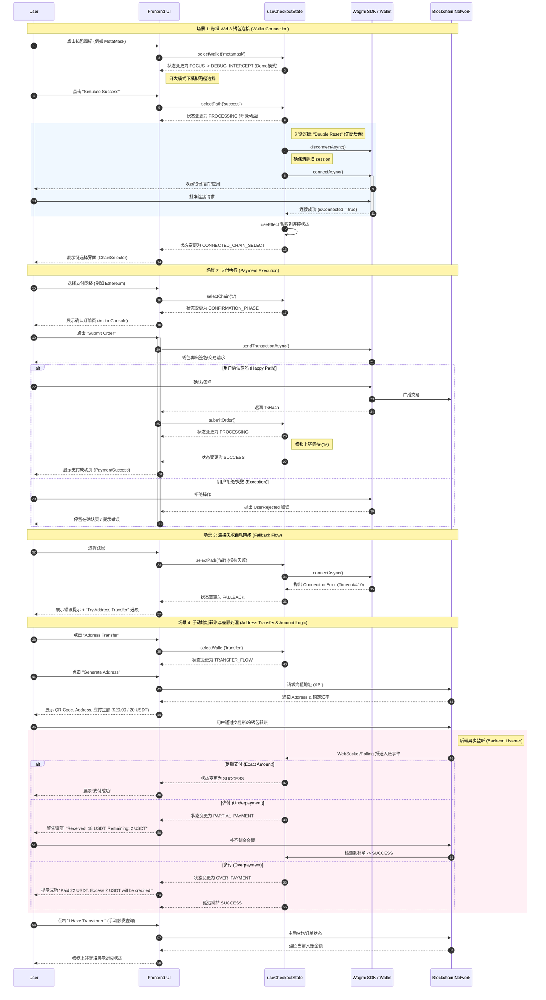

# 核心支付生命周期时序图 (Core Payment Lifecycle)

这份文档描述了 BonusPay 收银台的核心状态流转逻辑，用于指导测试用例编写。

> **图例说明:**
> - **Participants:**
>   - **User:** 最终用户
>   - **UI:** 收银台界面组件 (WalletGrid, ActionConsole 等)
>   - **Hook:** 核心状态机 (useCheckoutState)
>   - **Wagmi:** 钱包连接库与 Web3 钱包实例
>   - **Chain:** 区块链网络

